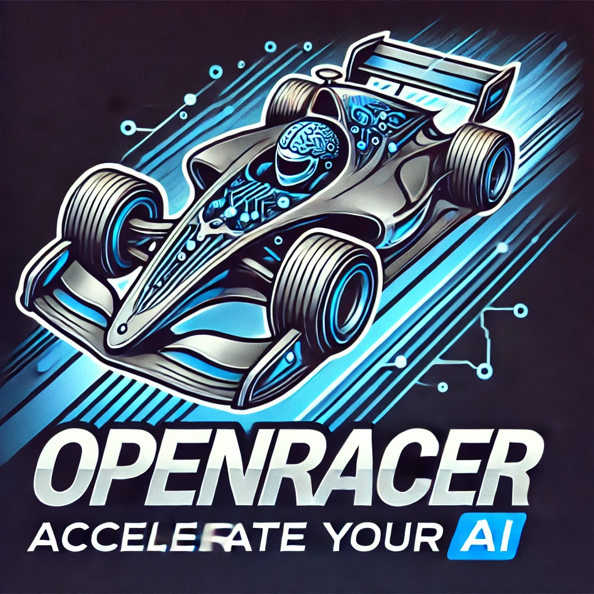

# OpenRacer

<center></center>

**OpenRacer** is an open-source platform that empowers you to train machine learning models for autonomous racing. Built with Python and powered by a Unity-based 3D environment, OpenRacer offers a dynamic and accessible way to develop and test AI models in a simulated racing environment.

## 🚀 Features

- **Python-Powered Training**: Use Python to develop, train, and fine-tune your machine learning models.
- **3D Unity Environment**: Experience immersive simulations with our Unity-based 3D racing environment, which connects to Python via WebSocket.
- **Custom Track Creation**: Generate your own tracks using coordinates provided by the server, or use premade tracks.
- **Real-Time Progress Monitoring**: Visualize your model's training progress and racing performance through an integrated web interface with live updates and detailed graphs.
- **Hyperparameter Tuning**: Easily adjust hyperparameters to optimize your model's performance.
- **Open-Source Flexibility**: Customize and extend the platform to suit your unique needs, thanks to its fully open-source codebase.

## 🎯 Impact

**"Democratizing Autonomous Racing: Empowering Innovators and Learners to Shape the Future of AI."**

OpenRacer is designed to lower the barrier to entry for autonomous racing and machine learning. Whether you're a hobbyist, a student, or a professional, our platform provides the tools you need to experiment, learn, and innovate in the field of AI.

## 📚 Getting Started

### Stable version for wider use will be released soon


### Nightly Installation

#### Prerequisites :

- Python 3.7+
- Unity 2022.3
- npm 9.5.0

#### Steps :

1. Clone the repository:

   ```bash
   git clone https://github.com/Loony4Logic/OpenRacer
   cd openracer
   ```

2. Install Python dependencies:

   ```bash
   cd "Python server"
   pip install -r requirements.txt
   ```

3. Open the Unity project:

   - Open Unity Hub, click on "Add Project," and select the `OpenRacer` folder within the project directory.

4. Start the web interface:

   ```bash
   cd React UI
   npm install
   npm start
   ```

## 🤝 Contributing

Contributions are welcome! Please create a issue or contact me though linkedin.
Will add structured issue and guidelines after a while. 

## 🛡️ License

This project is licensed under the MIT License - see the [LICENSE](LICENSE) file for details.

## 🙌 Acknowledgments

- Inspired by AWS DeepRacer.
- Special thanks to @TejasNair9977 for 3D model and @palakagarwal369 .
---